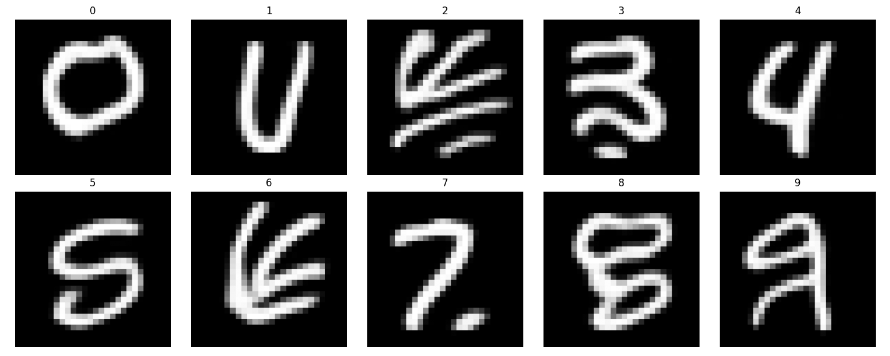
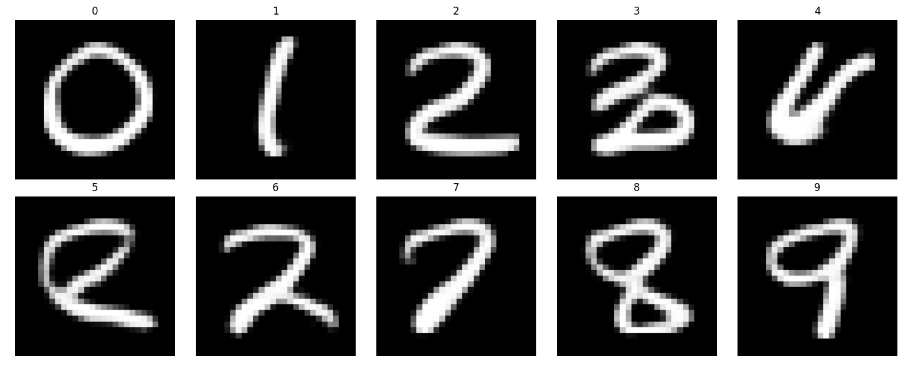
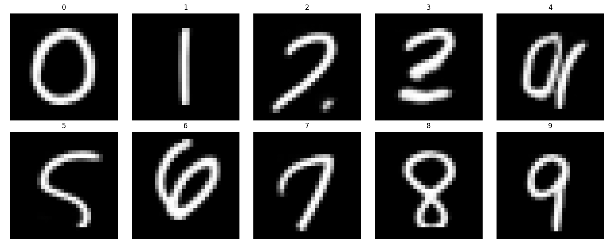
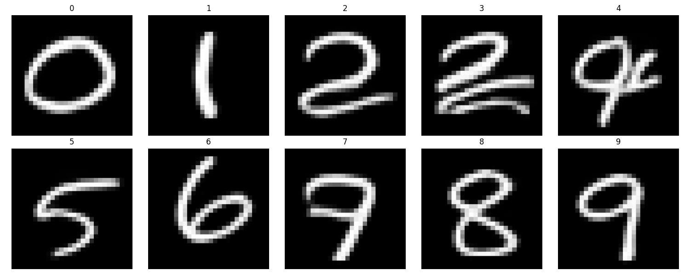

# CNN Autoregressive Model for MNIST Image Generation

A simple, custom-built autoregressive model for generating MNIST images using PyTorch.

## Overview
There are many, slightly different implementations/architectures of MNIST image generation in this repository. The main purpose of this repository is to explore how to build an effective autoregressive model for MNIST images using convolutional layers.

## Requirements
- Pytorch

## Usage
Just run one of the train codes and it will start training the model ans spit out sample images from the number 0 to 9.

## Architecture
To be written.

## Sample Output

